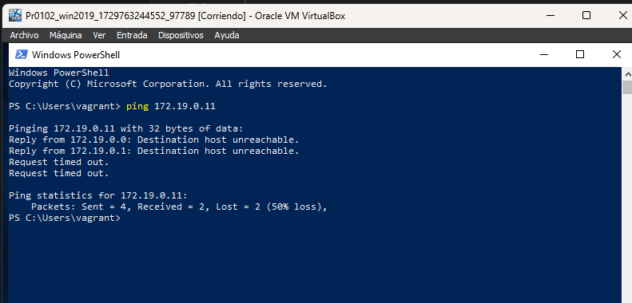

# ENTORNOS MULTIMÁQUINA

Una vez que nos encontremos en la carpeta donde realizaremos la práctica, 
abrimos en el buscador vagrantbox para buscar el sistema operativo requerido.

Añadimos la dirección con vagrant box add <dirección del sistema operativo>, 
una vez instalado iniciamos vagrant con el objetivo de crear el archivo correspondiente.
Ahora nos movemos en el vagrantfile para hacer los cambios oportunos.

```ruby
Vagrant.configure("2") do |config|
  config.vm.define "win2019" do |w19|
  w19.vm.box = "StefanScherer/windows_2019"
  w19.vm.network "private_network", ip:"172.19.0.0"
  w19.vm.provider "virtualbox" do |vb|
    vb.memory=4192
    vb.cpus=4
  end  
end
```
Incorporamos en el archivo la configuración de la segunda máquina
 correspondiente a Windows 10 para que al levantar la máquina, 
 directamente se inicien las dos máquinas

 ```bash
   config.vm.define "win10" do |w10|
    w10.vm.box = "scotch/box "
    w10.vm.network "private_network", ip:"172.19.0.11"  
    w10.vm.provider "virtualbox" do |vb|
      vb.memory=2048
      vb.cpus=2
    end
  end
end
  
   
  ```
Lo que conseguimos es crear un adaptador virtual para conectarse a la máquina física. Mapea puertos.


Hacemos un Vagrant rdp a la máquina que contiene Windows server
```bash
PS C:\GIT\aso_abgg\ut01\practicas\Pr0102> vagrant rdp win2019
==> win2019: Detecting RDP info...
    win2019: Address: 127.0.0.1:3389
    win2019: Username: vagrant
==> win2019: Vagrant will now launch your RDP client with the connection parameters
==> win2019: above. If the connection fails, verify that the information above is
==> win2019: correct. Additionally, make sure the RDP server is configured and
==> win2019: running in the guest machine (it is disabled by default on Windows).
==> win2019: Also, verify that the firewall is open to allow RDP connections.
PS C:\GIT\aso_abgg\ut01\practicas\Pr0102> 
```

## Recursos adicionales:
[**Fichero Vagrantfile**](./Vagrantfile)
  
