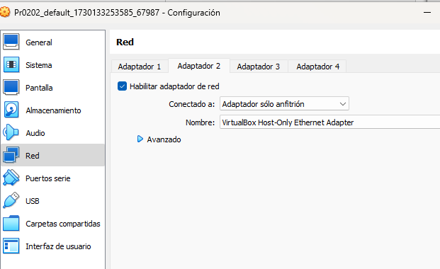
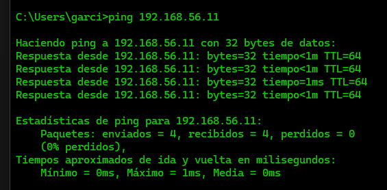

# Práctica 0202

## Conexión remota con SSH

Añadimos a nuestra caja de vagrant la nueva máquina virtual: ubuntu 2204
Utilizamos el comando vagrant box add
Comprobamos que está la máquina incluida en nuestra lista de la caja
Iniciamos la máquina con vagrant init, de esta forma creamos el Vagrantfile
Seguidamente levantamos la máquina y la apagamos con el comando sudo shutdown now
```bash
vagrant@ubuntu2204:~$ sudo shutdown now
```
Y en la máquina virtual añadimos un nuevo adaptador de red "Adaptador solo anfitrión"



Encendemos de nuevo la máquina y entramos con vagrant ssh para configurar el adaptador creado
Comprobamos las direcciones ip.

Al hacer estas comprobaciones con el comando "ip a" tengo algunas complicaciones, ya que no me aparece la ip del nuevo adaptador.

```bash
vagrant@ubuntu2204:~$ ip a
1: lo: <LOOPBACK,UP,LOWER_UP> mtu 65536 qdisc noqueue state UNKNOWN group default qlen 1000
    link/loopback 00:00:00:00:00:00 brd 00:00:00:00:00:00
    inet 127.0.0.1/8 scope host lo
       valid_lft forever preferred_lft forever
2: eth0: <BROADCAST,MULTICAST,UP,LOWER_UP> mtu 1500 qdisc fq_codel state UP group default qlen 1000
    link/ether 08:00:27:8c:69:41 brd ff:ff:ff:ff:ff:ff
    altname enp0s3
    inet 10.0.2.15/24 metric 100 brd 10.0.2.255 scope global dynamic eth0
       valid_lft 86087sec preferred_lft 86087sec
    inet6 fe80::a00:27ff:fe8c:6941/64 scope link
       valid_lft forever preferred_lft forever
3: eth1: <BROADCAST,MULTICAST> mtu 1500 qdisc noop state DOWN group default qlen 1000
    link/ether 08:00:27:72:bc:ab brd ff:ff:ff:ff:ff:ff
    altname enp0s8
```

Por lo tanto me dispongo a dar un valor de ip desde Vagrantfile
```bash 
config.vm.network "private_network", ip: "192.168.56.11"
```
De esta forma ya le damos un valor de ip, reiniciamos la máquina
```bash
PS C:\GIT\aso_abgg\ut02\Practicas\Pr0202> vagrant reload
```
Una vez que entramos de nuevo en el terminal de la máquina y solicitamos las ip:
```bash
vagrant@ubuntu2204:~$ ip a
1: lo: <LOOPBACK,UP,LOWER_UP> mtu 65536 qdisc noqueue state UNKNOWN group default qlen 1000
    link/loopback 00:00:00:00:00:00 brd 00:00:00:00:00:00
    inet 127.0.0.1/8 scope host lo
       valid_lft forever preferred_lft forever
2: eth0: <BROADCAST,MULTICAST,UP,LOWER_UP> mtu 1500 qdisc fq_codel state UP group default qlen 1000
    link/ether 08:00:27:8c:69:41 brd ff:ff:ff:ff:ff:ff
    altname enp0s3
    inet 10.0.2.15/24 metric 100 brd 10.0.2.255 scope global dynamic eth0
       valid_lft 86300sec preferred_lft 86300sec
    inet6 fe80::a00:27ff:fe8c:6941/64 scope link
       valid_lft forever preferred_lft forever
3: eth1: <BROADCAST,MULTICAST,UP,LOWER_UP> mtu 1500 qdisc fq_codel state UP group default qlen 1000
    link/ether 08:00:27:72:bc:ab brd ff:ff:ff:ff:ff:ff
    altname enp0s8
    inet 192.168.56.11/24 brd 192.168.56.255 scope global eth1
       valid_lft forever preferred_lft forever
    inet6 fe80::a00:27ff:fe72:bcab/64 scope link
       valid_lft forever preferred_lft forever
```
Para comprobar la ip del anfitrión (pc) utilizo el comando: "ipconfig" en el cmd del ordenador, ya que el sistema operativo en este caso es windows.

Ping desde mi ordenador (anfitrión) hasta la máquina virtual




Quizás lo más curioso, es que desde la máquina virtual se ha podido hacer ping a las diferentes ip reflejadas en mi ordenador, incluidas las que VM Ware ha creado. Por ejemplo:
```bash
vagrant@ubuntu2204:~$ ping 192.168.117.1
PING 192.168.117.1 (192.168.117.1) 56(84) bytes of data.
64 bytes from 192.168.117.1: icmp_seq=1 ttl=127 time=0.838 ms
64 bytes from 192.168.117.1: icmp_seq=2 ttl=127 time=1.30 ms
64 bytes from 192.168.117.1: icmp_seq=3 ttl=127 time=1.36 ms
64 bytes from 192.168.117.1: icmp_seq=4 ttl=127 time=1.64 ms
64 bytes from 192.168.117.1: icmp_seq=5 ttl=127 time=1.35 ms
64 bytes from 192.168.117.1: icmp_seq=6 ttl=127 time=1.30 ms
^C
--- 192.168.117.1 ping statistics ---
6 packets transmitted, 6 received, 0% packet loss, time 5023ms
rtt min/avg/max/mdev = 0.838/1.297/1.643/0.237 ms
```


