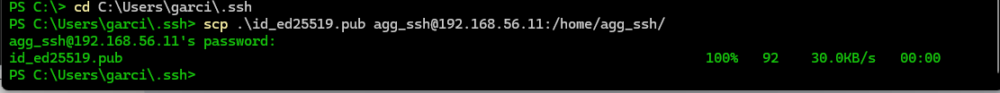

# Práctica 0202

## Conexión remota con SSH
### 1. Preparación de la máquina y configuración de la red

Añadimos a nuestra caja de vagrant la nueva máquina virtual: ubuntu 2204
Utilizamos el comando vagrant box add
Comprobamos que está la máquina incluida en nuestra lista de la caja
Iniciamos la máquina con vagrant init, de esta forma creamos el Vagrantfile
Seguidamente levantamos la máquina y la apagamos con el comando sudo shutdown now
```bash
vagrant@ubuntu2204:~$ sudo shutdown now
```
Y en la máquina virtual añadimos un nuevo adaptador de red "Adaptador solo anfitrión"


Encendemos de nuevo la máquina y entramos con vagrant ssh para configurar el adaptador creado
Comprobamos las direcciones ip.

Al hacer estas comprobaciones con el comando "ip a" tengo algunas complicaciones, ya que no me aparece la ip del nuevo adaptador.

```bash
vagrant@ubuntu2204:~$ ip a
1: lo: <LOOPBACK,UP,LOWER_UP> mtu 65536 qdisc noqueue state UNKNOWN group default qlen 1000
    link/loopback 00:00:00:00:00:00 brd 00:00:00:00:00:00
    inet 127.0.0.1/8 scope host lo
       valid_lft forever preferred_lft forever
2: eth0: <BROADCAST,MULTICAST,UP,LOWER_UP> mtu 1500 qdisc fq_codel state UP group default qlen 1000
    link/ether 08:00:27:8c:69:41 brd ff:ff:ff:ff:ff:ff
    altname enp0s3
    inet 10.0.2.15/24 metric 100 brd 10.0.2.255 scope global dynamic eth0
       valid_lft 86087sec preferred_lft 86087sec
    inet6 fe80::a00:27ff:fe8c:6941/64 scope link
       valid_lft forever preferred_lft forever
3: eth1: <BROADCAST,MULTICAST> mtu 1500 qdisc noop state DOWN group default qlen 1000
    link/ether 08:00:27:72:bc:ab brd ff:ff:ff:ff:ff:ff
    altname enp0s8
```

Por lo tanto me dispongo a dar un valor de ip desde Vagrantfile
```bash 
config.vm.network "private_network", ip: "192.168.56.11"
```
De esta forma ya le damos un valor de ip, reiniciamos la máquina
```bash
PS C:\GIT\aso_abgg\ut02\Practicas\Pr0202> vagrant reload
```
Una vez que entramos de nuevo en el terminal de la máquina y solicitamos las ip:
```bash
vagrant@ubuntu2204:~$ ip a
1: lo: <LOOPBACK,UP,LOWER_UP> mtu 65536 qdisc noqueue state UNKNOWN group default qlen 1000
    link/loopback 00:00:00:00:00:00 brd 00:00:00:00:00:00
    inet 127.0.0.1/8 scope host lo
       valid_lft forever preferred_lft forever
2: eth0: <BROADCAST,MULTICAST,UP,LOWER_UP> mtu 1500 qdisc fq_codel state UP group default qlen 1000
    link/ether 08:00:27:8c:69:41 brd ff:ff:ff:ff:ff:ff
    altname enp0s3
    inet 10.0.2.15/24 metric 100 brd 10.0.2.255 scope global dynamic eth0
       valid_lft 86300sec preferred_lft 86300sec
    inet6 fe80::a00:27ff:fe8c:6941/64 scope link
       valid_lft forever preferred_lft forever
3: eth1: <BROADCAST,MULTICAST,UP,LOWER_UP> mtu 1500 qdisc fq_codel state UP group default qlen 1000
    link/ether 08:00:27:72:bc:ab brd ff:ff:ff:ff:ff:ff
    altname enp0s8
    inet 192.168.56.11/24 brd 192.168.56.255 scope global eth1
       valid_lft forever preferred_lft forever
    inet6 fe80::a00:27ff:fe72:bcab/64 scope link
       valid_lft forever preferred_lft forever
```
Para comprobar la ip del anfitrión (pc) utilizo el comando: "ipconfig" en el cmd del ordenador, ya que el sistema operativo en este caso es windows.

Ping desde mi ordenador (anfitrión) hasta la máquina virtual


Quizás lo más curioso, es que desde la máquina virtual se ha podido hacer ping a las diferentes ip reflejadas en mi ordenador, incluidas las que VM Ware ha creado. Por ejemplo:
```bash
vagrant@ubuntu2204:~$ ping 192.168.117.1
PING 192.168.117.1 (192.168.117.1) 56(84) bytes of data.
64 bytes from 192.168.117.1: icmp_seq=1 ttl=127 time=0.838 ms
64 bytes from 192.168.117.1: icmp_seq=2 ttl=127 time=1.30 ms
64 bytes from 192.168.117.1: icmp_seq=3 ttl=127 time=1.36 ms
64 bytes from 192.168.117.1: icmp_seq=4 ttl=127 time=1.64 ms
64 bytes from 192.168.117.1: icmp_seq=5 ttl=127 time=1.35 ms
64 bytes from 192.168.117.1: icmp_seq=6 ttl=127 time=1.30 ms
^C
--- 192.168.117.1 ping statistics ---
6 packets transmitted, 6 received, 0% packet loss, time 5023ms
rtt min/avg/max/mdev = 0.838/1.297/1.643/0.237 ms
```

Para cambiar el hostname de la máquina abrimos una terminal y utilizamos el comando hostnamectl:
```bash
vagrant@ubuntu2204:~$ sudo hostnamectl set-hostname a
gg_server
vagrant@ubuntu2204:~$ sudo hostnamectl
 Static hostname: aggserver
 Pretty hostname: agg_server
       Icon name: computer-vm
         Chassis: vm
      Machine ID: a626621cad4e40a694106590139e8181
         Boot ID: bd5dcb048ef94f44b3010c37487d8360
  Virtualization: oracle
Operating System: Ubuntu 22.04.3 LTS
          Kernel: Linux 5.15.0-84-generic
    Architecture: x86-64
 Hardware Vendor: innotek GmbH
  Hardware Model: VirtualBox
```
En windows vamos a realizar los cambios necesarios para que resuelva localmente el nombre del servidor Ubuntu

Para ello abrimos el Bloc de notas como administrador. En Archivo desplegamos y seleccionar Abrir, desde aquí abrimos el archivo host, que se encuentra en:

#### C\Windows\System32\Drivers\etc\hosts


Guardamos los cambios y cerramos el bloc de notas

Para comprobar que ha funcionado, abrir el Símbolo del sistema y hacer un ping al nombre que hemos dado.


### 2. Creación del usuario y conexión ssh

```bash
vagrant@ubuntu2204:~$ sudo adduser agg_ssh
Adding user `agg_ssh' ...
Adding new group `agg_ssh' (1001) ...
Adding new user `agg_ssh' (1001) with group `agg_ssh' ...
Creating home directory `/home/agg_ssh' ...
Copying files from `/etc/skel' ...
New password: 
```
Comprobamos que tenemos instalado el servidor SSH

```bash
vagrant@ubuntu2204:~$ sudo service sshd status
● ssh.service - OpenBSD Secure Shell server
     Loaded: loaded (/lib/systemd/system/ssh.service; enabled; vendor preset: enabled)
     Active: active (running) since Tue 2024-10-29 08:39:24 UTC; 26min ago
       Docs: man:sshd(8)
             man:sshd_config(5)
   Main PID: 3166 (sshd)
      Tasks: 1 (limit: 2220)
```bash
vagrant@ubuntu2204:~$ ls /etc/ssh
moduli      ssh_config.d  sshd_config.d         ssh_host_ecdsa_key      ssh_host_ed25519_key      ssh_host_rsa_key      ssh_import_id
ssh_config  sshd_config   sshd_config.ucf-dist  ssh_host_ecdsa_key.pub  ssh_host_ed25519_key.pub  ssh_host_rsa_key.pub
```
En el caso de que no fuera así, lo debemos instalar con el siguiente comando:

sudo apt install openssh-server

Vamos al Power Shell del anfitrión


Vemos que aparece un mensaje de seguridad, le decimos que sí queremos seguir conectados.


Queda de esta forma realizada la conexión por el puerto 22


Generar clave pública y privada desde el cliente:



Enviamos la clave pública al servidor, en este caso lo haremos de un equipo a otro con el comando "scp", que permite la trasmisión de ficheros entre dos equipos de la red.

Nos situamos en la ruta donde se encuentran los archivos y ejecutamos el comando


