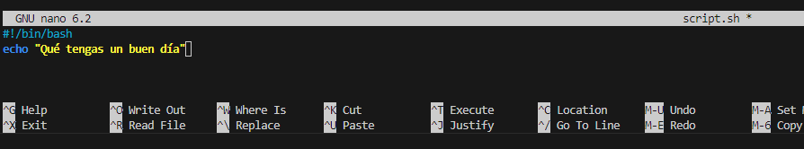
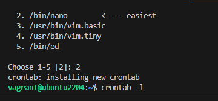
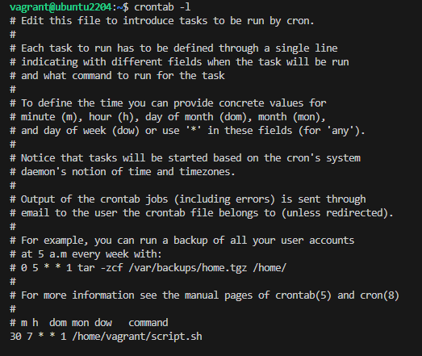
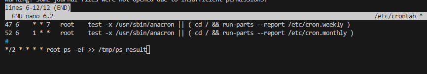
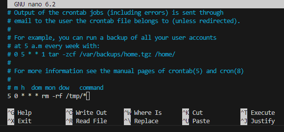

# Práctica PR0204

## Programación de tareas con cron


### Órdenes de contrab según los casos
   
La tarea se ejecuta cada hora:   0**** 

Los domingos cada 3 horas:   0*/3**0

A las 12 de la mañana los días pares del mes:  0 12 */2 **

El primer día de cada mes a las 8:00 y las 20:00:  0 8,20 1 **

Cada media hora de lunes a viernes:  */30 ***1-5

Cada cuarto de hora, entre las 3 y las 8 de lunes a viernes, 
durante todo el mes de agosto:  */15 3-8 * 8 1-5

Cada 90 minutos:  30 */1,*/3 ***

### Como se comprueba si el servicio se está ejecutando

"ps aux | grep cron | grep -v grep"

ps lista todos los procesos del sistema; -a muestra todos los procesos; 
-u muestra a los propietarios; -x muestra los procesos que no tienen un terminal controlado
grep se usa para buscar un patrón (palabra) y poder filtrar información.

También podemos usar el comando: "pgrep cron" para mostrar el ID de los procesos
cron que estén en ejecución.

```bash
vagrant@ubuntu2204:~$ ps aux | grep cron | grep -v grep
root         832  0.0  0.1   6892  3064 ?        Ss   07:51   0:00 /usr/sbin/
vagrant@ubuntu2204:~$ pgrep cron
598
```
Otros comandos que se pueden usar en este caso son:
```bash
vagrant@ubuntu2204:~$ systemctl status cron
● cron.service - Regular background program processing daemon
     Loaded: loaded (/lib/systemd/system/cron.service; enabled; vendor preset: enabled)
     Active: active (running) since Wed 2024-10-30 16:41:08 UTC; 3min 12s ago
       Docs: man:cron(8)
   Main PID: 598 (cron)
      Tasks: 1 (limit: 2220)
     Memory: 2.6M
lines 1-7
```
```bash
vagrant@ubuntu2204:~$ service cron status
● cron.service - Regular background program processing daemon
     Loaded: loaded (/lib/systemd/system/cron.service; enabled; vendor preset: enabled)
     Active: active (running) since Wed 2024-10-30 16:41:08 UTC; 3min 58s ago
       Docs: man:cron(8)
   Main PID: 598 (cron)
      Tasks: 1 (limit: 2220)
     Memory: 2.6M
lines 1-7
```

### ¿Cuál es el efecto de la siguiente línea crontab?:   */15 1,2,3 * * * who > /tmp/test

*/15= la tarea se ejecuta cada 15 minutos

1,2,3= la tarea se ejecuta a la 1,2 y 3 de la madrugada

***= todos las días del mes, todos los meses y todos los días de la semana

who= muestra quien está conectado  al archivo /tmp/test.

Por tanto, cada 15 minutos entre la 1 y las 3 de la mañana el archivo /tmp/test
se actualiza con las personas conectadas en ese momento

### Indicar la ruta del fichero crontab del sistema:

Ruta del fichero contrab del sistema: /etc/contrab
```bash
vagrant@ubuntu2204:~$ cat /etc/crontab
# /etc/crontab: system-wide crontab
# Unlike any other crontab you don't have to run the `crontab'       
# command to install the new version when you edit this file
# and files in /etc/cron.d. These files also have username fields,   
# that none of the other crontabs do.
```
```bash
vagrant@ubuntu2204:~$ ls /etc/crontab
/etc/crontab
```
### ¿Qué ficheros controlan los usuarios que pueden utilizar el "crontab"?

Ficheros controlados por los usuarios que pueden usar el contrab: el 
fichero es: "cron.allow", sólo los usuarios que se encuentran en él pueden crear,
editar, mostrar o eliminar Ficheros contrab
```bash
vagrant@ubuntu2204:~$ cat /etc/cron.allow
cat: /etc/cron.allow: No such file or directory
vagrant@ubuntu2204:~$ cat /etc/cron.deny
cat: /etc/cron.deny: No such file or directory
```
### Excepcionalmente se debe iniciar una tarea llamada script.sh todos los lunes a las 07:30h antes de entrar en clase ¿Cómo lo harías?

Creamos el script con el editor



Seguidamente abrimos crontab
```bash 
vagrant@ubuntu2204:~$ crontab -e
no crontab for vagrant - using an empty one

Select an editor.  To change later, run 'select-editor'.
  1. /usr/bin/vim.nox
  2. /bin/nano        <---- easiest
  3. /usr/bin/vim.basic
  4. /usr/bin/vim.tiny
  5. /bin/ed

Choose 1-5 [2]: 
```
Añadimos al final la orden para que se ejecute el script en los tiempos indicados:

30 7 * * 1 (ruta al script)



En la  imagen anterior podemos ver como se indica que se ha instalado el nuevo crontab

Hacemos la comprobación con el comando: crontab -l



### Listar y cancelar tarea:  

Listamos las tareas del crontab con el comando: crontab -l, como vemos en la imagen anterior. 

Para elimiar la tarea utilizamos la orden -r acompañando al comando crontab
```bash
vagrant@ubuntu2204:~$ crontab -r
vagrant@ubuntu2204:~$ crontab -l
no crontab for vagrant
```

### Ejecución comando ps -ef para root:  2**** root /tmp/ps_result

Vamos a editar el archivo con el editor 




### Verificar la lista de tareas en contrab: 

Tenemos dos comandos dependiendo de que usuario seamos:

para un usuario normal:  contrab -l

para el administrador: contrab -u (usuario) -l, de esta forma veremos
las tareas de cualquier usuario. También usando sudo.

```bash
vagrant@ubuntu2204:~$ sudo crontab -l
# Edit this file to introduce tasks to be run by cron.
#
# Each task to run has to be defined through a single line
# indicating with different fields when the task will be run
# and what command to run for the task
#
# To define the time you can provide concrete values for
# minute (m), hour (h), day of month (dom), month (mon),
# and day of week (dow) or use '*' in these fields (for 'any').
#
# Notice that tasks will be started based on the cron's system
# daemon's notion of time and timezones.
#
# Output of the crontab jobs (including errors) is sent through
# email to the user the crontab file belongs to (unless redirected).
#
# For example, you can run a backup of all your user accounts
# at 5 a.m every week with:
# 0 5 * * 1 tar -zcf /var/backups/home.tgz /home/
#
# For more information see the manual pages of crontab(5) and cron(8)
#
# m h  dom mon dow   command
*/2 * * * * ps -ef >> /tmp/ps_result
```

También podemos utilizar el comando "cat"

```bash
vagrant@ubuntu2204:~$  cat /tmp/ps_result
UID          PID    PPID  C STIME TTY          TIME CMD
root           1       0  0 14:59 ?        00:00:02 /sbin/init =
root           2       0  0 14:59 ?        00:00:00 [kthreadd]
root           3       2  0 14:59 ?        00:00:00 [rcu_gp]
root           4       2  0 14:59 ?        00:00:00 [rcu_par_gp]
root           5       2  0 14:59 ?        00:00:00 [slub_flushwq]
root           6       2  0 14:59 ?        00:00:00 [netns]
root           7       2  0 14:59 ?        00:00:00 [kworker/0:0-rcu_gp]
root           8       2  0 14:59 ?        00:00:00 [kworker/0:0H-events_highpri]
root           9       2  1 14:59 ?        00:00:03 [kworker/u4:0-events_power_efficient]
root          10       2  0 14:59 ?        00:00:00 [mm_percpu_wq]
root          11       2  0 14:59 ?        00:00:00 [rcu_tasks_rude_
```
 
### Crear el usuario asir2 y prohibirle usar el crontab

```bash
vagrant@ubuntu2204:~$ sudo useradd asir2
vagrant@ubuntu2204:~$ echo "asir2" | sudo tee -a /etc/cron.deny
asir2
```

### Verificamos que asir2 no puede utilizar crontab

```bash
vagrant@ubuntu2204:~$ sudo -u asir2 crontab -e
You (asir2) are not allowed to use this program (crontab)
See crontab(1) for more information
```
### Programamos crontab para que todos los días a las 00:05 se eliminen todos los ficheros que se encuentren en el directorio /tmp.

Utilizamos el comando "crontab -e" para editar la orden



Podemos verificar la lista de tareas programadas con el comando:

"crontab -l"

### Programa una tarea en el sistema que se lance de lunes a viernes a las 9 de la mañana durante los meses de verano (julio, agosto y septiembre) que escriba en un fichero la hora actual (comando date, aunque tienes que mirar la ayuda para elegir un formato comprensible) seguido del listado de usuarios que hay conectados en ese momento en el sistema (comando who)

```bash
0 9 * 7-9 1-5 echo "date '+%Y-%m-%d %H:%M:$S') -$(who)" >> /etc/crontab/usuarioconectado.txt
vagrant@ubuntu2204:~$ crontab -e
crontab: installing new crontab
```
### El servicio cron se ayuda de una serie de ficheros y directorios que se encuentran en el directorio /etc. Explica la función de cada uno de los siguientes ficheros/directorios:

- cron.d : proporciona una forma de separar los trabajos cron relacionados con la administración del sistema y la gestión de paquetes. Contiene archivos adicionales de configuración de tareas
- cron. allow : es una listda de los usuarios autorizadas para usar cron
- cron.deny : lista de usuarios que no tienen permiso para usar cron
- cron.daily : contiene tareas programadas para ejecutarse diariamente
- cron.hourly : contiene tareas programadas para ejecutarse cada hora
- cron.monthly : contiene tareas programadas para ejecutarse mensualmente.