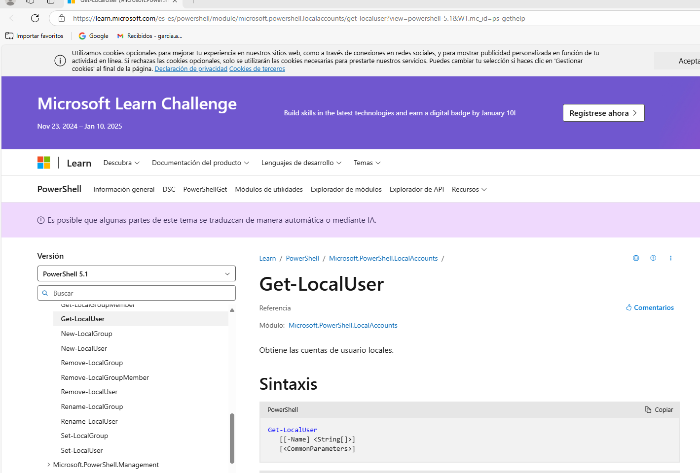
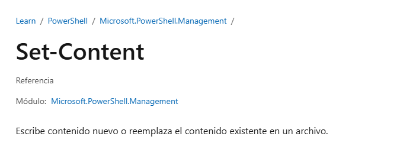
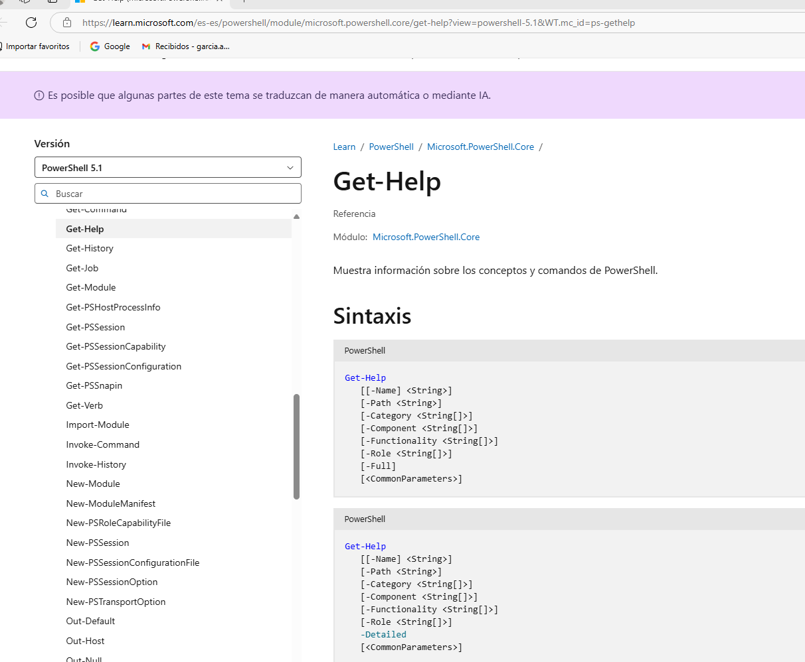

# INTRODUCCIÓN A POWERSHELL
## Práctica 0401
## Para obtener información de un comando podemos solicitar la ayuda. Es necesario actualizarla para tener la última versión. Se ejecutará el comando Update-Help

### 1. Obtener ejemplos de utilización del comando Get-LocalUser
```bash
PS C:\GIT\aso_abgg\ut04\Practicas\PR0401> Get-Help -Name Get-LocalUser -Examples
(Podemos también, suprimir la palabra -Name en el comando)
NOMBRE
    Get-LocalUser
    
SINOPSIS
    Gets local user accounts.
    
    
    --------- Example 1: Get an account by using its name ---------
    
    Get-LocalUser -Name "AdminContoso02"
    
    Name             Enabled Description
     ----             ------- -----------
    AdminContoso02   True    Description of this account.


    Example 2: Get an account that is connected to a Microsoft account

    Get-LocalUser -Name "MicrosoftAccount\username@Outlook.com"

    Name                                    Enabled  Description
    ----                                    -------  -----------
    MicrosoftAccount\username@outlook.com  True     Description of this account.
        ----- Example 3: Get an account that has the specified SID -----

    Get-LocalUser -SID S-1-5-21-9526073513-1762370368-3942940353-500

    Name          Enabled Description
    ----          ------- -----------
    Administrator True    Built-in account for administering the computer/domain
```
### 2. Obtener un listado de todos los comandos relacionados con la gestión de usuarios locales (LocalUser)
```bash
PS C:\GIT\aso_abgg\ut04\Practicas\PR0401> Get-Command -Name *LocalUser*

CommandType     Name                                               Version    Source
-----------     ----                                               -------    ------
Cmdlet          Disable-LocalUser                                  1.0.0.0    Microsoft.PowerShell.LocalAccounts
Cmdlet          Enable-LocalUser                                   1.0.0.0    Microsoft.PowerShell.LocalAccounts
Cmdlet          Get-LocalUser                                      1.0.0.0    Microsoft.PowerShell.LocalAccounts
Cmdlet          New-LocalUser                                      1.0.0.0    Microsoft.PowerShell.LocalAccounts
Cmdlet          Remove-LocalUser                                   1.0.0.0    Microsoft.PowerShell.LocalAccounts
Cmdlet          Rename-LocalUser                                   1.0.0.0    Microsoft.PowerShell.LocalAccounts
Cmdlet          Set-LocalUser                                      1.0.0.0    Microsoft.PowerShell.LocalAccounts
```
##### LocalUser va entre asteriscos (*) para indicar que busque los comandos que tengan incluido ese término, funcionan como un comodín.

### 3. Mostrar en el navegador la ayuda del comando Get-LocalUser
```bash
PS C:\GIT\aso_abgg\ut04\Practicas\PR0401> Get-Help Get-LocalUser -Online
```

### 4. Explicar para que sirve el comando Set-Content
```bash
PS C:\GIT\aso_abgg\ut04\Practicas\PR0401> Get-Help Set-Content -Online
Cuando se abre la web podemos ver la ayuda para ese comando

Se nos informa de que el comando se utiliza para escribir contenido nuevo o "reemplazar" el existente en un archivo.
```
### 5. Cómo ver o buscar un comando usado anteriormente
```bash
PS C:\GIT\aso_abgg\ut04\Practicas\PR0401> Get-History

  Id CommandLine
  -- -----------
   1 try { . "c:\Users\garci\AppData\Local\Programs\Microsoft VS Code\resources\app\out\vs\workbench\contrib\terminal\common\scripts\shell... 
   2 Get-Help -Name Get-LocalUser -Examples
   3 Get-Command -Name LocalUser
   4 LocalUser
   5 Get-Command -Name *LocalUser*
   6 Get-Help Get-LocalUser -Online
   7 Set-Content
   8 Get-Help Set-Content -Online
```
```bash
Como vemos en el caso anterior con el comando Get-History enseña "todos" los comandos que se han usado en la sesión abierta.
Si escribimos "h" nos da la misma información que el comando anterior
```
```bash
PS C:\GIT\aso_abgg\ut04\Practicas\PR0401> h

  Id CommandLine
  -- -----------
   1 try { . "c:\Users\garci\AppData\Local\Programs\Microsoft VS Code\resources\app\out\vs\workbench\contrib\terminal\common\scripts\shell... 
   2 Get-Help -Name Get-LocalUser -Examples
   3 Get-Command -Name LocalUser
   4 LocalUser
   5 Get-Command -Name *LocalUser*
   6 Get-Help Get-LocalUser -Online
   7 Set-Content
   8 Get-Help Set-Content -Online
   9 Get-History
```
```bash
Otra opción es manejar las teclas de flecha arriba/flecha abajo, que irán mostrando ordenadamente los comandos introducidos desde el último al primero
```
```bash
La siguiente opción consiste en pulsar Ctrl-R (para ir hacia atrás) o Ctrl-S (para ir hacia adelante) y comenzar a escribir el nombre del comando para que nos salga en la línea
PS C:\GIT\aso_abgg\ut04\Practicas\PR0401> Get-History
bck-i-search: G_
```
### 6. Averiguar si el comando Get-Process tiene un parámetro llamado ComputerName y si es afirmativo indicar para que sirve
```bash
Otra forma de obtener información sin necesidad de acudir (llamar) a la página web es utilizar el parámetro
PS C:\GIT\aso_abgg\ut04\Practicas\PR0401> Get-Help Get-Process -Parameter ComputerName

-ComputerName <System.String[]>
    Specifies the computers for which this cmdlet gets active processes. The default is the local computer.

    Type the NetBIOS name, an IP address, or a fully qualified domain name (FQDN) of one or more computers. To specify the local computer,    
    type the computer name, a dot (`.`), or `localhost`.

    This parameter does not rely on Windows PowerShell remoting. You can use the ComputerName parameter of this cmdlet even if your computer  
    is not configured to run remote commands.

    ¿Requerido?                  false
       ¿Posición?                   named
    Valor predeterminado         Local computer
    ¿Aceptar canalización?       True (ByPropertyName)
    ¿Aceptar caracteres comodín? false
```
```bash
Nos dice las computadoras en las que la obtención de procesos está activo, por defecto en la máquina local. Se puede usar aunque el ordenador no esté configurado para procesos remotos.
```
### 7. Mostrar la ayuda del comando Start-VM en una ventana emergente:
```bash
PS C:\GIT\aso_abgg\ut04\Practicas\PR0401> Get-Help Start-VM -ShowWindow                                                                       Get-Help : Get-Help no pudo encontrar Start-VM en un archivo de Ayuda en esta sesión. Para descargar los temas de Ayuda actualizados,         escribe: "Update-Help". Para obtener Ayuda en pantalla, busca el tema de Ayuda en la biblioteca de TechNet en                                 https:/go.microsoft.com/fwlink/?LinkID=107116.                                                                                                
En línea: 1 Carácter: 1
+ Get-Help Start-VM -ShowWindow
+ ~~~~~~~~~~~~~~~~~~~~~~~~~~~~~
    + CategoryInfo          : ResourceUnavailable: (:) [Get-Help], HelpNotFoundExceptin
    + FullyQualifiedErrorId : HelpNotFound,Microsoft.PowerShell.Commands.GetHelpCommand
```
### 8. Mostrar la ayuda del comando Get-Help en el navegador
```bash

PS C:\GIT\aso_abgg\ut04\Practicas\PR0401> Get-Help Get-Help -online
```
### 9. Mostrar las últimas 20 entradas del historial
```bash
PS C:\GIT\aso_abgg\ut04\Practicas\PR0401> Get-History -count 20

  Id CommandLine
  -- -----------
   1 try { . "c:\Users\garci\AppData\Local\Programs\Microsoft VS Code\resources\app\out\vs\workbench\contrib\terminal\common\scripts\shell... 
   2 Get-Help -Name Get-LocalUser -Examples
   3 Get-Command -Name LocalUser
   4 LocalUser
   5 Get-Command -Name *LocalUser*
   6 Get-Help Get-LocalUser -Online
   7 Set-Content
   8 Get-Help Set-Content -Online
   9 Get-History
  10 h
   11 Get-History
  12 Get-Help Get-Process -Parameter ComputerName
  13  Get-Process -Parameter ComputerName
  14  Get-Process  ComputerName
  15 Get-Help Start-VM -ShowWindow
  16 Get-Help -Name Start-VM -ShowWindow
  17 Get-Help -Name Start-VM -Online
  18 Get-Help -online
  19 Get-Help Get-Help -online
```
### 10. Eliminar las entradas 10, 12 y 14 del historial
```bash
PS C:\GIT\aso_abgg\ut04\Practicas\PR0401> Clear-History -Id 10, 12, 14
PS C:\GIT\aso_abgg\ut04\Practicas\PR0401> Get-History                 

  Id CommandLine
  -- -----------
   1 try { . "c:\Users\garci\AppData\Local\Programs\Microsoft VS Code\resources\app\out\vs\workbench\contrib\terminal\common\scripts\shell... 
   2 Get-Help -Name Get-LocalUser -Examples
   3 Get-Command -Name LocalUser
   4 LocalUser
   5 Get-Command -Name *LocalUser*
   6 Get-Help Get-LocalUser -Online
   7 Set-Content
   8 Get-Help Set-Content -Online
   9 Get-History
    11 Get-History
  13  Get-Process -Parameter ComputerName
  15 Get-Help Start-VM -ShowWindow
  16 Get-Help -Name Start-VM -ShowWindow
  17 Get-Help -Name Start-VM -Online
  18 Get-Help -online
  19 Get-Help Get-Help -online
  20 Get-History -count 20
  21 Clear-History -Id 10, 12, 14
```
```bash
Como se puede comprobar se han eliminado las entradas solicitadas.
```
