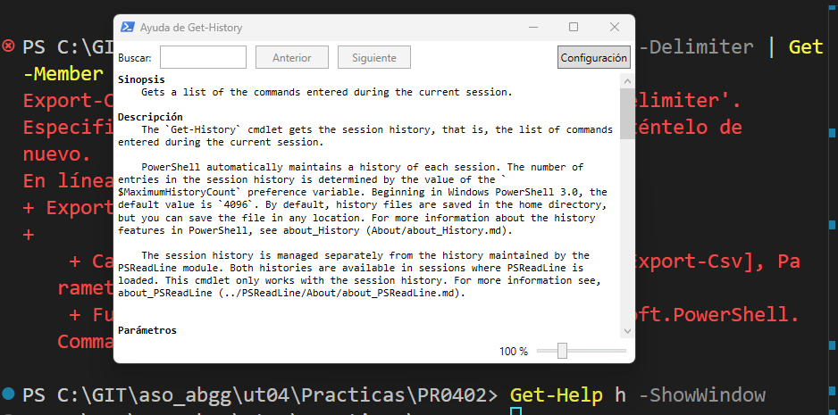

# INTRODUCCIÓN A POWERSHELL (II)
## Práctica 0402

### 1. Visualizar las últimas cinco entradas del historial, mostrando para cada una el comando, la hora en que finalizó su ejecución y el estado de ejecución.
```powershell
Primero buscamos el nombre de las propiedades solicitadas con:
PS C:\GIT\aso_abgg\ut04\Practicas\PR0402> Get-History | Get-Member 
   TypeName: Microsoft.PowerShell.Commands.HistoryInfo

Name               MemberType Definition
----               ---------- ----------
Clone              Method     Microsoft.PowerShell.Commands... 
Equals             Method     bool Equals(System.Object obj)   
GetHashCode        Method     int GetHashCode()
GetType            Method     type GetType()
ToString           Method     string ToString()
CommandLine        Property   string CommandLine {get;}
EndExecutionTime   Property   datetime EndExecutionTime {get;}
ExecutionStatus    Property   System.Management.Automation....
Id                 Property   long Id {get;}
StartExecutionTime Property   datetime StartExecutionTime {...
```
```powershell

PS C:\GIT\aso_abgg\ut04\Practicas\PR0402> Get-History -count 5 | select-Object Commandline, EndExecutionTime, ExecutionStatus

CommandLine                                    EndExecutionTime   ExecutionStatus
-----------                                    ----------------   ---------------
Get-Help Get-History                           28/11/2024 9:15:53       Completed
get-help Get-History -online                   28/11/2024 9:16:47       Completed
Get-History -count 5 | Format-List -Property*  28/11/2024 9:19:24       Completed
Get-History -count 5 | Format-List -Property * 28/11/2024 9:19:30       Completed
Get-History | Get-Member                       28/11/2024 9:43:29       Completed
```
```powershell
No será necesario añadir "object" después de "select"
PS C:\GIT\aso_abgg\ut04\Practicas\PR0402> Get-History -count 5 | select Commandline, EndExecutionTime, ExecutionStatus       

CommandLine                                                                         EndExecutionTime   ExecutionStatus
-----------                                                                         ----------------   ---------------
get-help Get-History -online                                                        28/11/2024 9:16:47       Completed
Get-History -count 5 | Format-List -Property*                                       28/11/2024 9:19:24       Completed
Get-History -count 5 | Format-List -Property *                                      28/11/2024 9:19:30       Completed
Get-History | Get-Member                                                            28/11/2024 9:43:29       Completed
Get-History -count 5 | select-Object Commandline, EndExecutionTime, ExecutionStatus 28/11/2024 9:47:18       Completed
```
### 2. Ejecutar el comando Get-Command e interrumpirlo antes de que finalice su ejecución pulsando Ctrl-C. A continuación, ejecutarlo dejando que finalice correctamente
```powershell
En este primer ejemplo cortamos el comando
PS C:\GIT\aso_abgg\ut04\Practicas\PR0402> Get-Command
Cmdlet          Get-WindowsImageContent                            3.0        Dism
Cmdlet          Get-WindowsOptionalFeature                         3.0        Dism
Cmdlet          Get-WindowsPackage                                 3.0        Dism
Cmdlet          Get-WindowsReservedStorageState                    3.0        Dism
Cmdlet          Get-WindowsSearchSetting                           1.0.0.0    WindowsSearch
Cmdlet          Get-WinEvent                                       3.0.0.0    Microsoft.PowerShell.Diagnostics
Cmdlet          Get-WinHomeLocation                                2.1.0.0    International
Cmdlet          Get-WinLanguageBarOption                           2.1.0.0    International
Cmdlet          Get-WinSystemLocale                                2.1.0.0    International
Cmdlet          Get-WinUILanguageOverride                          2.1.0.0    International
Cmdlet          Get-WinUserLanguageList                            2.1.0.0    International
Cmdlet          Get-WmiObject                                      3.1.0.0    Microsoft.PowerShell.Management
Cmdlet          Get-WSManCredSSP                                   3.0.0.0    Microsoft.WSMan.Management
Cmdlet          Get-WSManInstance                                  3.0.0.0    Microsoft.WSMan.Management
Cmdlet          Group-Object                                       3.1.0.0    Microsoft.PowerShell.Utility
PS C:\GIT\aso_abgg\ut04\Practicas\PR0402>
```
```powershell
Si lo ejecutamos hasta el final se observa:
Cmdlet          Wait-Event                                         3.1.0.0    Microsoft.PowerShell.Utility
Cmdlet          Wait-Job                                           3.0.0.0    Microsoft.PowerShell.Core
Cmdlet          Wait-Process                                       3.1.0.0    Microsoft.PowerShell.Management
Cmdlet          Where-Object                                       3.0.0.0    Microsoft.PowerShell.Core
Cmdlet          Write-Debug                                        3.1.0.0    Microsoft.PowerShell.Utility
Cmdlet          Write-Error                                        3.1.0.0    Microsoft.PowerShell.Utility
Cmdlet          Write-EventLog                                     3.1.0.0    Microsoft.PowerShell.Management
Cmdlet          Write-Host                                         3.1.0.0    Microsoft.PowerShell.Utility
Cmdlet          Write-Information                                  3.1.0.0    Microsoft.PowerShell.Utility
Cmdlet          Write-Output                                       3.1.0.0    Microsoft.PowerShell.Utility
Cmdlet          Write-Progress                                     3.1.0.0    Microsoft.PowerShell.Utility
Cmdlet          Write-Verbose                                      3.1.0.0    Microsoft.PowerShell.Utility
Cmdlet          Write-Warning                                      3.1.0.0    Microsoft.PowerShell.Utility


PS C:\GIT\aso_abgg\ut04\Practicas\PR0402>
```
### 3. Volver a ejecutar el comando del punto 1 y comprobar las diferentes salidas de finalización del estado de ejecución
```powershell
PS C:\GIT\aso_abgg\ut04\Practicas\PR0402> h -count 5 | select Commandline, EndExecutionTime, ExecutionStatus          

CommandLine EndExecutionTime   ExecutionStatus
----------- ----------------   ---------------
Get-Command 28/11/2024 9:51:51       Completed
Get-Command 28/11/2024 9:52:03       Completed
Get-Command 28/11/2024 9:52:08         Stopped
Get-Command 28/11/2024 9:53:26         Stopped
Get-Command 28/11/2024 9:53:45       Completed
```
### 4. Mostrar todos los procesos con el nombre msedge, mostrando para cada uno el identificador, el consumo de CPU y los hilos
```powershell
PS C:\GIT\aso_abgg\ut04\Practicas\PR0402> Get-Process -name msedge |Get-Member
PS C:\GIT\aso_abgg\ut04\Practicas\PR0402> Get-Process -name msedge | select Id, CPU, Threads

   Id      CPU Threads
   --      --- -------
 3420  1,46875 {5748, 2564, 17252, 4288...}
 8692    0,125 {14944, 17836, 16176, 3708...}
10156      0,5 {9964, 16184, 7608, 1976...}  
12904        0 {4448, 11676, 11648, 13376...}
13072 0,015625 {3940, 8020, 9252, 4388...}
16324 0,015625 {9972, 18248, 2356, 15044...}
18064        0 {5004, 416, 2700, 1780...}
```
### 5. Averiguar para que sirve el parámetro -Delimiter del comando Export-CSV
```powershell
PS C:\GIT\aso_abgg\ut04\Practicas\PR0402> Get-Help Export-CSV -Parameter Delimiter

-Delimiter <System.Char>
    Specifies a delimiter to separate the property values. The       
    default is a comma (`,`). Enter a character, such as a colon     
    (`:`). To specify a semicolon (`;`), enclose it in quotation     
    marks.

    ¿Requerido?                  false
    ¿Posición?                   1
    Valor predeterminado         comma (,)
    ¿Aceptar canalización?       False
    ¿Aceptar caracteres comodín? false
```
### 6. Mostrar en una ventana la ayuda del comando Get-History
```powershell

```
### 7. Mostrar un listado con todos los comandos que tengan el verbo Update
```powershell
PS C:\GIT\aso_abgg\ut04\Practicas\PR0402> Get-Command -Verb Update
CommandType     Name                                               V 
                                                                   e 
                                                                   r 
                                                                   s 
                                                                   i 
                                                                   o 
                                                                   n 
-----------     ----                                               - 
Function        Update-AutologgerConfig                            1 
Function        Update-Disk                                        2 
Function        Update-DscConfiguration                            1 
Function        Update-EtwTraceSession                             1 
Function        Update-HostStorageCache                            2 
Function        Update-IscsiTarget                                 1 
Function        Update-IscsiTargetPortal                           1 
Function        Update-Module                                      1 
Function        Update-ModuleManifest                              1 
Function        Update-MpSignature                                 1 
Function        Update-MpSignature                                 1 
Function        Update-NetFirewallDynamicKeywordAddress            2 
Function        Update-NetIPsecRule                                2 
Function        Update-Script                                      1 
Function        Update-ScriptFileInfo                              1 
Function        Update-SmbMultichannelConnection                   2
Function        Update-StorageBusCache                             1 
Function        Update-StorageFirmware                             2 
Function        Update-StoragePool                                 2 
Function        Update-StorageProviderCache                        2 
Cmdlet          Update-FormatData                                  3 
Cmdlet          Update-Help                                        3 
Cmdlet          Update-LapsADSchema                                1 
Cmdlet          Update-List                                        3 
Cmdlet          Update-TypeData                                    3 
Cmdlet          Update-UevTemplate                                 2 
Cmdlet          Update-WIMBootEntry                                3 
```
### 8. Ejecutar la herramienta Recortes y localizarla usando el comando Get-Process, teniendo en cuenta que el proceso se llama SnippingTool.exe

