# ADMINISTRACIÓN REMOTA DEL SERVIDOR
## Práctica 0404

### 1. Entorno Virtualizado: Se necesita la siguiente configuración de máquinas virtuales:
### - Windows Server 2019 con experiencia de escritorio
### - Windows Server 2016 en modo Core, que tendrá dos adaptadores de red, uno en modo NAT y otro en modo solo-anfitrión
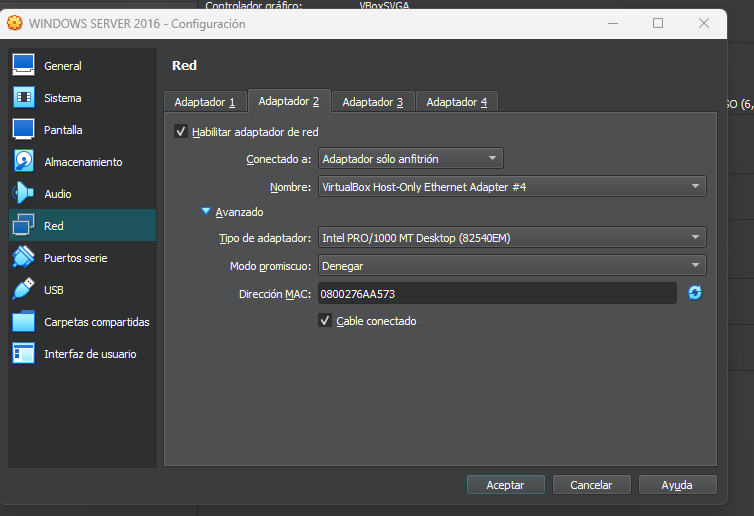
### Vamos a aprovechar la misma red que preparamos el otro día (172.25.0.0/16) para añadir el nuevo equipo a la misma a través de su adaptador en modo solo-anfitrión.
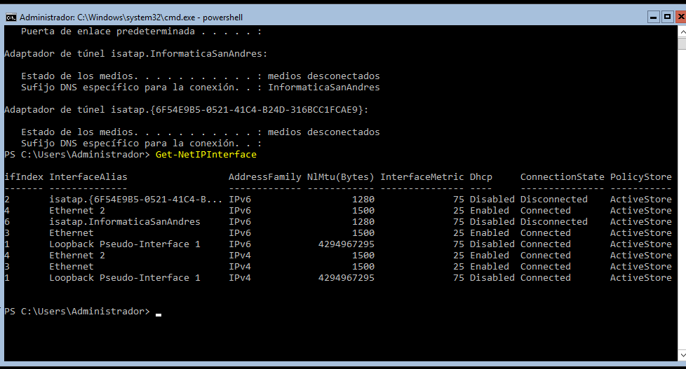
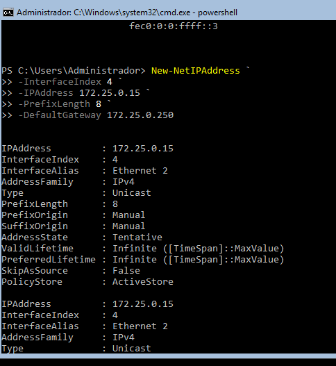
### 2. Preparación de las máquinas
### - Añade el nuevo equipo a la red, comprueba que tiene visibilidad con los tres equipos que ya tienes en ella (las dos máquinas virtuales y el equipo anfitrión)
### - Asigna nombres a los equipo, estos nombres serán:
### Windows Server 2019 con entorno gráfico: {INICIALES}-2019
### Windows Server 2019 en modo core: {INICIALES}-CORE-2019
### Windows Server 2016 en modo core: {INICIALES}-CORE-2016
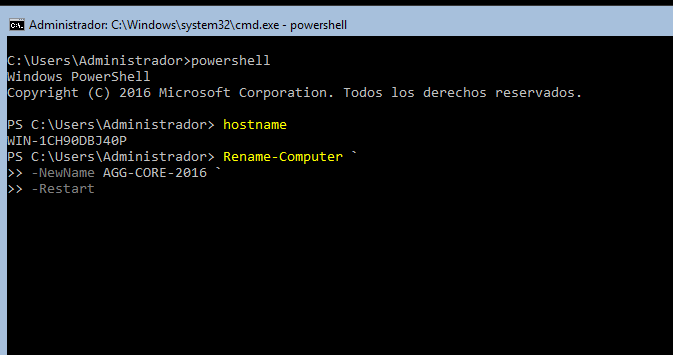
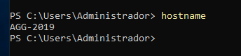
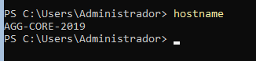
### Desactivamos el Firewall para comprobar la conectividad entre ellos
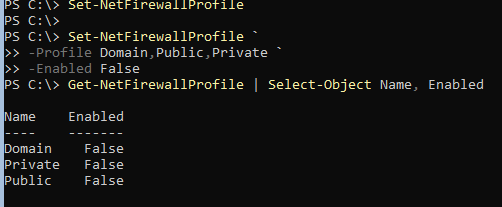
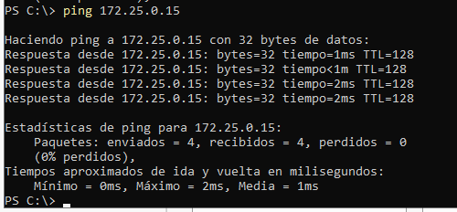
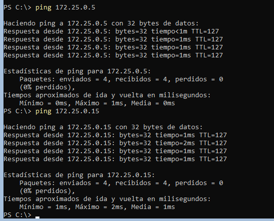
### 3. Configuración del acceso remoto al nuevo equipo
### - Realizar los pasos necesarios para poder usar PowershellDirect sobre el nuevo equipo desde el servidor principal (AGG-2019)
#### En la máquina de WS2016 ejecutamos el comando: "Enable-PSRemoting -Force" para habilitar la comunicación remota
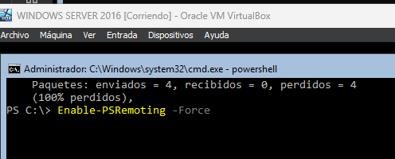
#### Comprobamos los hosts confiables, como vemos en la imagen inferior WS2016 está incluido en la lista de confiables. En el caso de que no fuera afirmativo, tendríamos que utilizar el comando Set-Item WSMan:\localhost\Client\TrustedHosts -Value "ipv4"
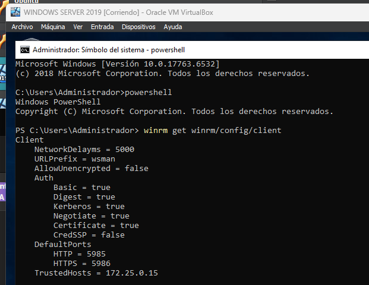
### -Asegúrate de que sigas pudiendo administrar el otro equipo en modo Core
### -Para comprobarlo, crear de forma remota en ambos equipos en modo Core un usuario con privilegios de administrador llamado AGG. 
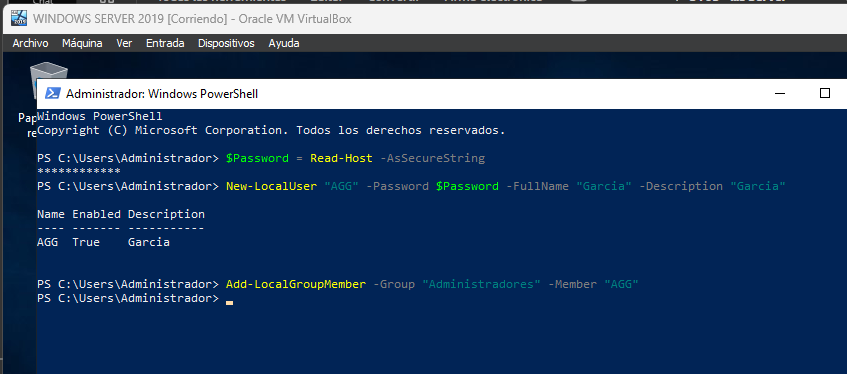
### 4. Configuración del acceso remoto sobre HTTPS. 
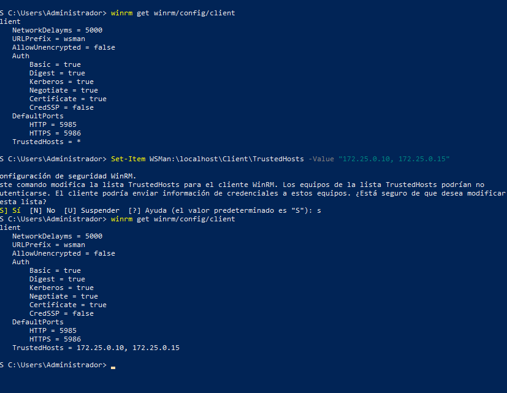
#### Como se ve en la imagen anterior, al ejecutar el comando Set-Item dos veces lo que se hace es sobreescribir la ip en la que se puede confiar. Por tanto, o bien ponemos una coma para poder escribir las dos IPs como en la imagen inferior. 
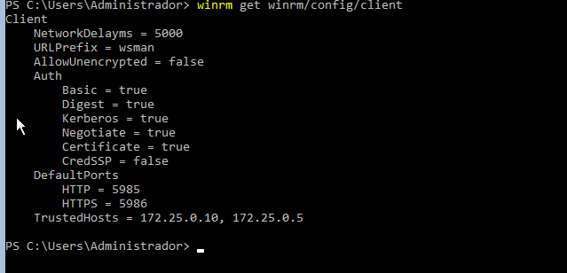
#### O bien, lo añadimos como se muestra en la diapositiva número 15.
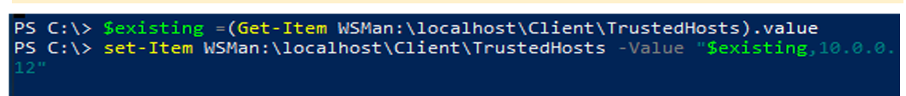
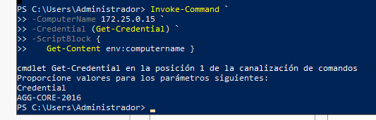
#### Una vez comprobado que está todo bien configurado es el momento de asegurar la red preparándola para que utilice WinRM sobre HTTPS utilizando un certificado autofirmado. 
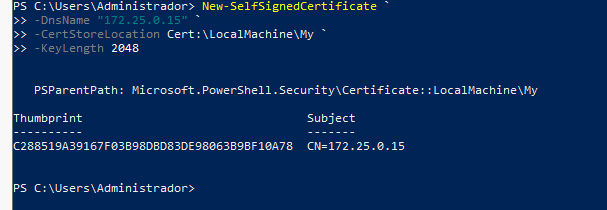
#### Eliminamos el Listener HTTP (este paso es opcional)
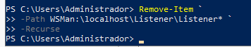
#### Creamos un nuevo Listener para ese certificado
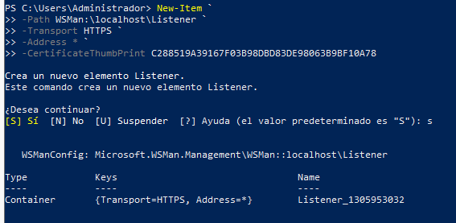
#### Nos aseguramos de que el puerto 5986 esté abierto en el firewall
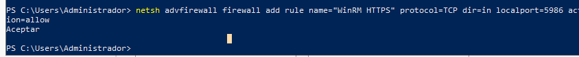
#### Comprobamos la configuración del Listener
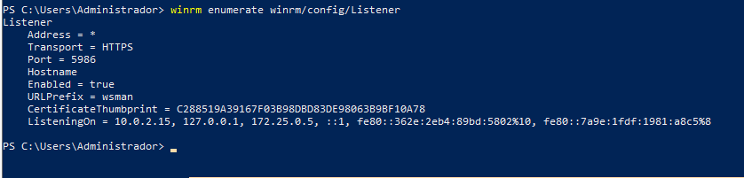
#### Vamos a exportar el certificado para poder conectarnos por HTTPS
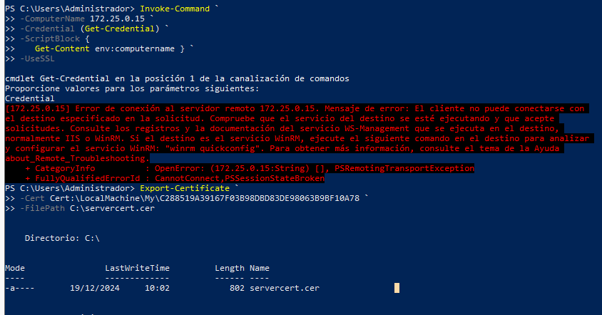
#### Creamos una carpeta compartida en Server 2019 con entorno gráfico y enviamos allí el certificado.

#### Realizar los pasos necesarios para que la comunicación con ambos servidores use ese mecanismo

### 5. Configurar los equipos para poder administrarlos de forma remota utilizando Windows Admin Center desde el equipo con entorno gráfico.