# CARPETAS PERSONALES Y COMPARTIDAS POR UN GRUPO

## Creación de usuarios y grupos:
#### 1. Crear en el dominio los usuarios uperez y fgonzalez
###### Abrimos el Administrador del Servidor y clicamos en Herramientas , donde seleccionamos Usuarios y equipos de Active Directory
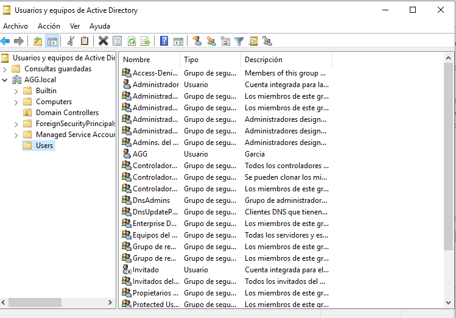
###### Desde aquí en la zona derecha de la pantalla nos aparece la opción "Users", la marcamos con el botón derecho para seleccionar Nuevo>Usuario
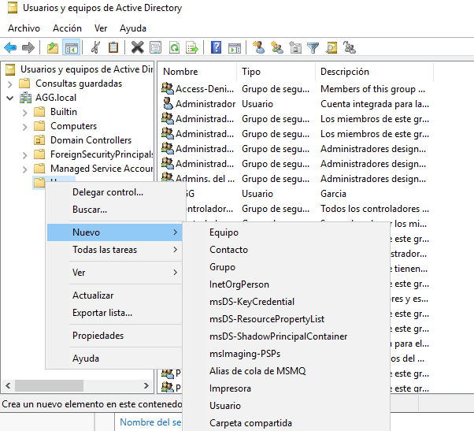
###### Rellenamos los campos de la nueva ventana.
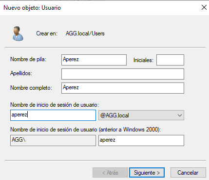
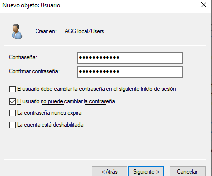
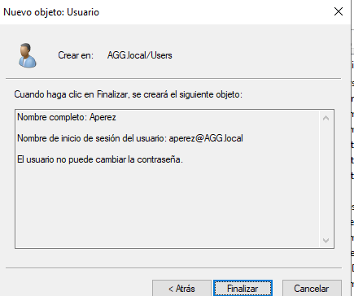
###### Hacemos lo mismo para el siguiente usuario
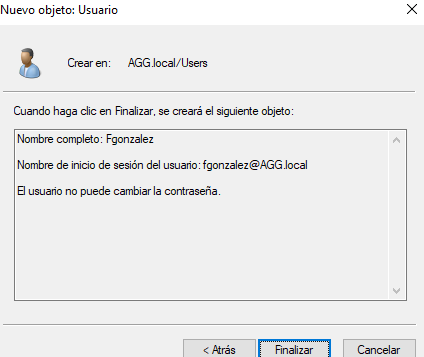
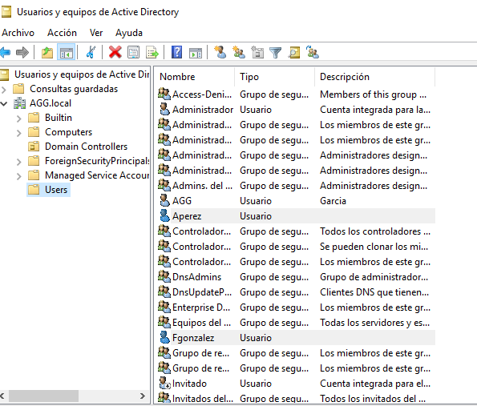
#### 2. Crear un grupo global denominado alumnos y agregar los usuarios que se crearon anteriormente.
###### Desde el mismo lugar "Users", pero esta vez seleccinamos "Grupo"
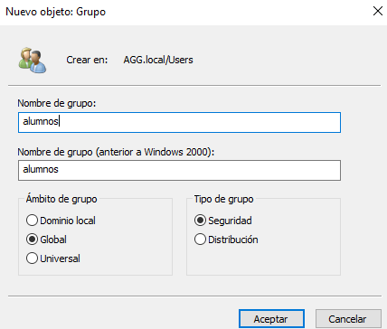
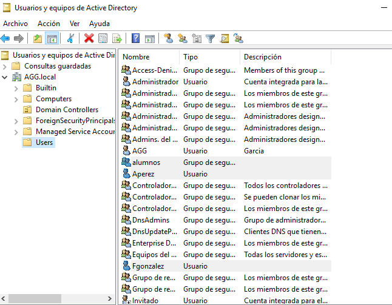
###### Introducimos ahora los usuarios dentro del grupo creado. Para ello seleccionamos el grupo y clicamos con el botón derecho para seleccionar propiedades>Miembros>Agregar
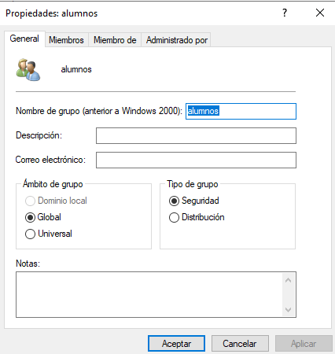
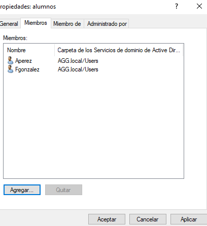
## Carpetas personales:
#### 1. Instalar el Adminsitrador de recursos del servidor de archivos que está dentro del rol Servicios de archivos y alamacenamiento
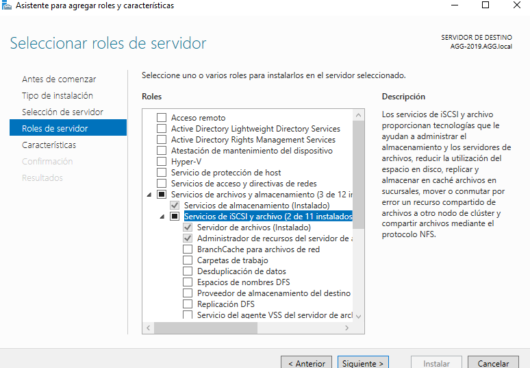
#### 2. Utilizando la herramienta Servicios de archivos y de almacenamiento del Administrador del servidor, crear una carpeta para cada usuario dentro de C:\shares y realizar los pasos necesarios para que ambos usuarios puedan ver esta carpeta como una unidad de red identificada con la letra H:
###### El Servicio de archivos y almacenamiento se encuentra en la ventana principal de Active Directori (en la izquierda de la pantalla)
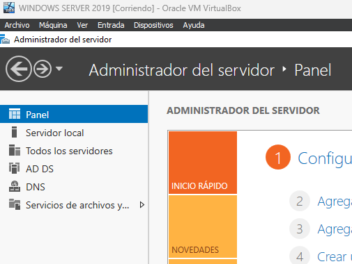
#### 3. Comprobar que la carpeta de cada usuario solo puede ser accedida por él mismo