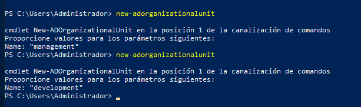
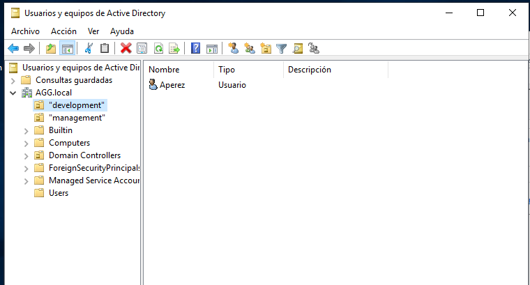
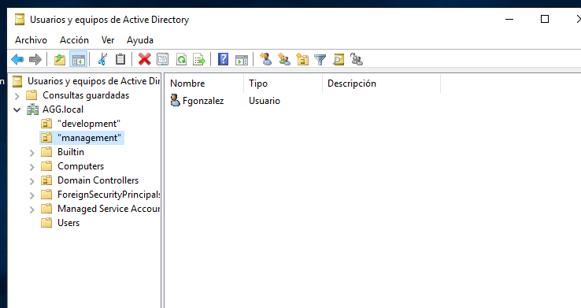
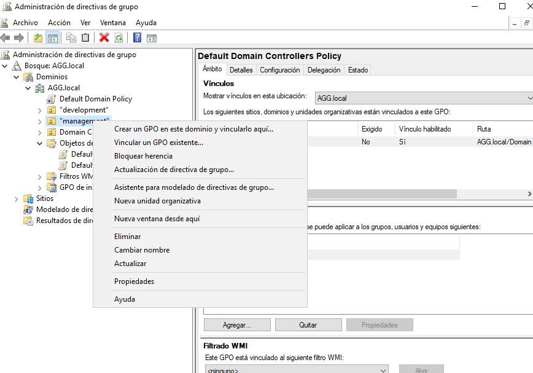
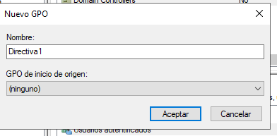
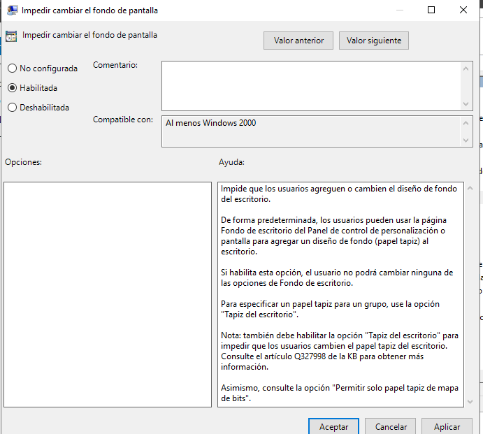
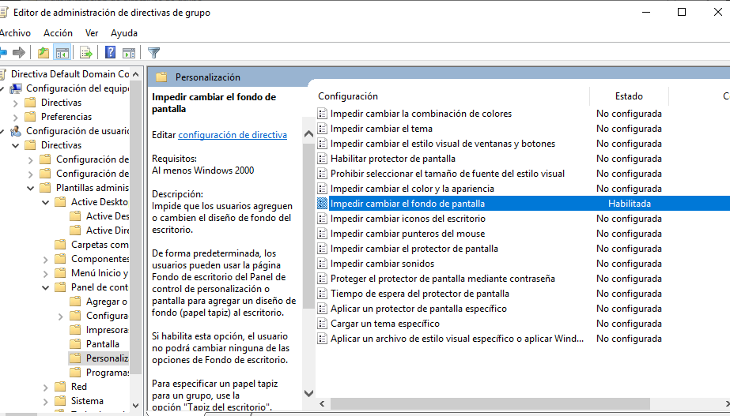
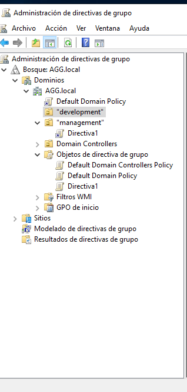
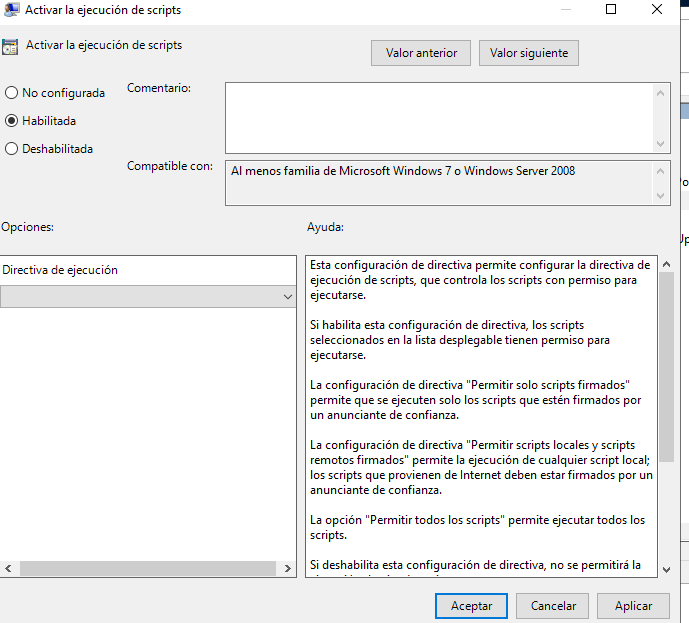
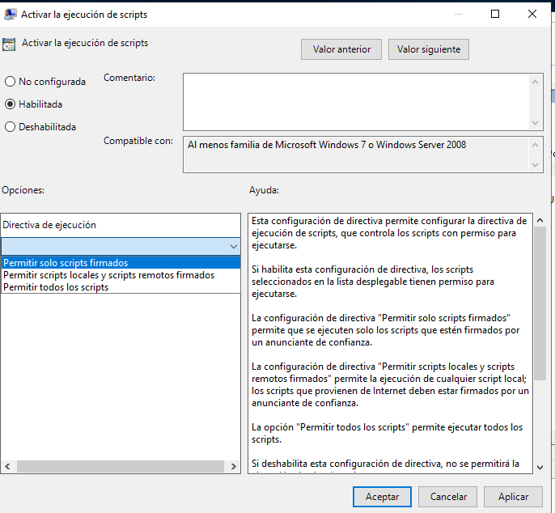

# PRÁCTICA  PR0501: APLICACIÓN DE DIRECTIVAS
## CARACTERÍSTICAS:
- Dominio: aso.local
- Unidades organizativas
  - Usuarios: contiene los usuarios del dominio divididos en dos unidades organizativas:
    - management
    - development
  - Equipos: contiene los equipos de los empleados
### Creamos las unidades organizativas con powershell

### Se podía haber realizado desde Usuarios y equipos de Active Directory. 
### Continuamos incorporando los usuarios a las unidades organizativas, de modo que Aperez pertenezca a la unidad development y Fgonzalez a la UO management. El cambio lo he realizado arrastrando los usuarios a su carpeta.

### Directiva 1. No se puede cambiar el fondo de pantalla del escritorio. Se aplica a los usuarios del grupo management
#### Entramos en Herramientas>Administración de directivas de grupo y en la parte izquierda de la pantalla y sobre el grupo donde queremos hacer los cambios "management" clicamos con el botón derecho para seleccionar "Crear GPO en este dominio y vincularlo aquí"

#### Objetos de directiva de grupo> Directiva 1>Configuración>En un espacio en blanco clicar con el botón derecho y seleccionar Editar para que se abra el Editor de directivas de grupo>Configuración de usuario>Directivas>Plantillas administrativas>Active Desktop>Active Desktop>Tapiz del escritorio. Clicando dos veces se abre una nueva ventana.
#### Dentro de esa nueva ventana, veremos el comentario que nos indica que podemos "Impedir cambios en el papel tapiz" desde Configuración usuario>Plantillas administrativas>Panel de Control
#### Por tanto, nos dirigimos al Panel de control>Personalizacións>Impedir cambiar el fondo de pantalla, clicamos con el botón derecho Editar y se abre una ventana donde Habilitamos la opción

### Directiva 2. Se pueden ejecutar scripts de powershell sin restricciones. Se aplica a los usuarios del grupo development
#### Configuración de equipo> Plantillas administrativas>Componentes de Windows>Windows powershell> En la nueva ventana Habilitar y en el desplegable Directivas de ejecución>Permitir todos los scripts

### Directiva 3. El firewall de Windows está habilitado. Se aplica a todos los equipos del dominio, hay una excepción donde no debe aplicarse, al equipo DEV-PC1

crear una uo llamada equipos con w10, otra uo llamada usuarios donde metemos development y management
proteger objeto contra eliminación accidental para mover carpetas sino tenemos permiso
será buena idea luego deshabilitar la configuración o bien de equipo o bien de usuario, es decir la que no se haya aplicado en la directiva

